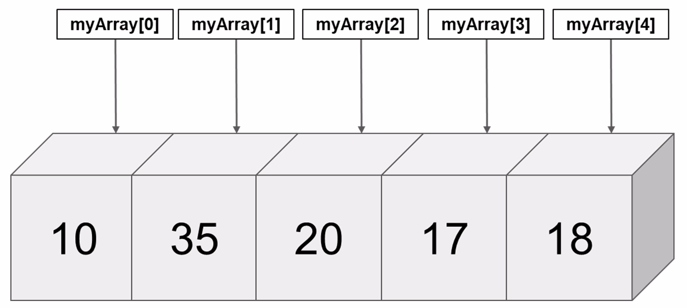
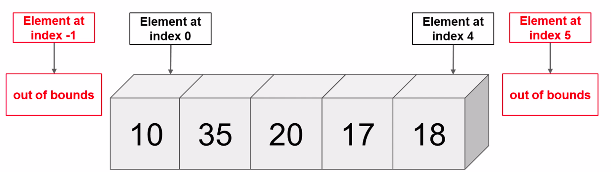
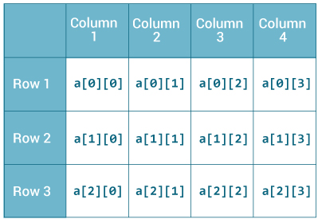
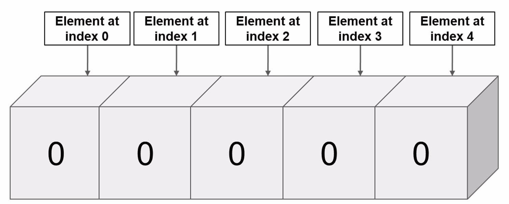

= Array

== Intro

=== Problem

[.step]
* Что если необходимо хранить в памяти множество однотипных данных, например: фамилии студентов в группе.
* Создадим такое же количество переменных как и студентов!
* А что если появится новый студент? Переписывать программу?!

=== Solution

[.fragment]
*Array*

== Array

=== Array

[.fragment]

=== Array

[.step]
* *Массив* — это конечная последовательность упорядоченных по индексу элементов одного типа, доступ к каждому элементу в которой осуществляется по этому индексу.
* Размер или длина массива — это общее количество элементов в массиве. Размер массива задаётся при создании массива и не может быть изменён в дальнейшем.

=== Syntax

[.fragment]
[source,java]
----
тип_данных[] название_массива;
// либо
тип_данных []название_массива;
// либо
тип_данных название_массива[];
----

=== Example

[.fragment]
[source,java]
----
int[] array1; // best practice
int []array2;
int array3[];
----

=== Example

[.fragment]
[source,java]
----
int nums[]; // объявили
nums = new int[4]; // инициализировали (массив из 4 чисел)
----

=== Example

[.fragment]
[source,java]
----
// объявим и инициализируем массив из 4 чисел
int nums[] = new int[4];
// объявим и инициализируем массив из 15 чисел
int[] nums2 = new int[15];
----

=== Example

[.fragment]
[source,java]
----
// объявим и инициализируем массив из 4 чисел
int[] nums = new int[4];
// инициализируем 0-ой элемент массива
nums[0] = 1;
// инициализируем 1-ый элемент массива
nums[1] = 2;
// инициализируем 2-ой элемент массива
nums[2] = 4;
// инициализируем 3-ий элемент массива
nums[3] = 100;
System.out.println(nums[2]); // 4
----

=== Example

[.fragment]
[source,java]
----
// эти два способа равноценны
int[] nums = new int[] {1, 2, 3, 5};
int[] nums2 = {1, 2, 3, 5}; // anonymous array
System.out.println(nums.length); // длина массива 4
----

=== Example

[.fragment]
[source,java]
----
int[] array = new int[10];
Random rand = new Random();
for (int i = 0; i < array.length; i++) {
    array[i] = rand.nextInt(10);
}

System.out.println("initial array:");
for (int i = 0; i < array.length; i++) {
    System.out.print(array[i] + "   ");
}

for (int i = 0; i < array.length; i++) {
    array[i] += 10;
}

System.out.println("new array:");
for (int i = 0; i < array.length; i++) {
    System.out.print(array[i] + "   ");
}
----

== What can go wrong?

=== What can go wrong?

[.fragment]
[source,java]
----
int[] nums = {1, 2, 3, 5};
System.out.println(nums[-1]);
System.out.println(nums[4]);
----

=== `ArrayIndexOutOfBoundsException`

[.fragment]

== Multidimensional Array

=== Multidimensional Array

[.fragment]
Массивы бывают:
[.step]
* одномерные
* двумерные
* n-мерные

=== Multidimensional Array

[.fragment]

=== Syntax

[.fragment]
[source,java]
----
int[][] array1;
int [][]array2;
int array3[][];
----

=== Example

[.fragment]
[source,java]
----
int[] nums1 = new int[] {0, 1, 2, 3, 4, 5};
int[][] nums2 = {
    {0, 1, 2},
    {3, 4, 5}
};
----

=== Example

[.fragment]
[source,java]
----
int[][] nums2 = {{0, 1, 2}, {3, 4, 5}};

// установим элемент первого столбца второй строки
nums2[1][0] = 44;
System.out.println(nums2[1][0]);
----

=== Multidimensional Arrays

[.fragment]
image:../../assets/img/java/core/array/array-2d-variable-length.jpg[Multidimensional Array]

=== Example

[.fragment]
[source,java]
----
int[][] nums = new int[3][];
nums[0] = new int[2];
nums[1] = new int[3];
nums[2] = new int[5];
...
----

=== Example

[.fragment]
[source,java]
----
int[][] array = {
    {1, 1, 1, 1},
    {1, 1, 1, 1},
    {1, 1, 1, 1}
};
int sum = 0;
for (int i = 0; i < array.length; i++) {
    for (int j = 0; j < array[0].length; j++) {
         sum += array[i][j];
    }
}
System.out.println(sum);
----

== Default initialization for Array

=== Default initialization for Array

[.fragment]

=== Default initialization for Array

[.fragment]
[options="header"]
|===
|Initialization|Content
|`new boolean[3]`|`{false, false, false}`
|`new int[3]`|`{0, 0, 0}`
|`new double[3]`|`{0.0, 0.0, 0.0}`
|`new String[3]`|`{null, null, null}`
|`new int[3][]`|`{null, null, null}`
|===

== Сортировка массивов

=== Сортировка массивов

[.step]
* Сортировка выбором.
* Сортировки с помощью обменов:
[.step]
** Пузырьковая сортировка.
** Шейкерная сортировка.
* Сортировка с помощью включения.
* Сортировка слиянием.
* Сортировка с помощью разделения.

=== Сортировка выбором

[.fragment]
[source,java]
----
int[] array = {8, 5, 2, 6, 9, 3, 1, 4, 0, 7};

for (int i = 0; i < array.length; i++) {
    int minIndex = i;
    for (int j = i + 1; j < array.length; j++) {
        if (array[j] < array[minIndex]) {
            minIndex = j;
        }
    }
    int temp = array[i];
    array[i] = array[minIndex];
    array[minIndex] = temp;
}

for (int i = 0; i < array.length; i++) {
    System.out.print(array[i] + “    ”);
}
----

=== Пузырьковая сортировка

[.fragment]
[source,java]
----
int[] array = {5, 4, 3, 1, 2};
for (int i = array.length - 1; i > 0; i--) {
    for (int j = 0; j < i; j++) {
        if (array[j] > array[j + 1]) {
            int temp = array[j];
            array[j] = array[j + 1];
            array[j + 1] = temp;
        }
    }
}
for (int i = 0; i < array.length; i++) {
    System.out.print(array[i] + "   ");
}
----
