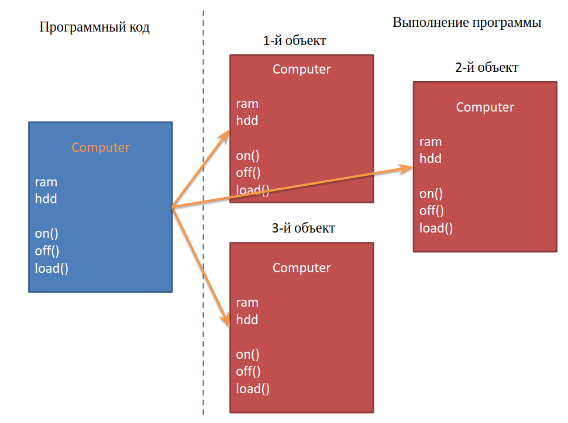
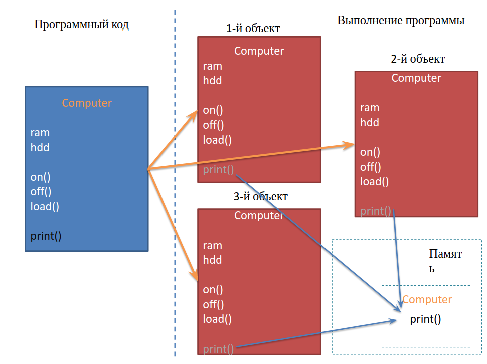

= Modifiers

== Modifiers

[.step]
* *Access modifiers* (*Модификаторы доступа*):
* *Non-Access modifiers* (*Другие модификаторы*):

=== Access modifiers

[.step]
* `public`
* `private`
* `protected`

=== Non-Access modifiers

[.step]
* `abstract`
* `final`
* `native`
* `static`
* `synchronized`
* `transient`
* `volatile`

== Modifier `final`

=== Modifier `final`

[.step]
* *Field*, объявленная `final` не может изменить своё значение.
* *Method*, объявленный `final` не может быть переопределён в подклассе.
* *Class*, объявленный `final` не может иметь подклассы.

=== Modifier `final`

[.fragment]
Модификатор `final` (_неизменяемый_) может применяться к классам, методам и переменным.

[.fragment]
[source,java]
final double PI = 3.14; // константы

[.fragment]
[source,java]
final void run() {} // запрещено переопределение метода

[.fragment]
[source,java]
final class Example {} // запрещено наследование

=== Example

[.fragment]
[source,java]
----
public final class Person {
}
----

[.fragment]
[source,java]
----
class Employee extends Person {
} // Compile error
----

=== Example

[.fragment]
[source,java]
----
public class Person {
    public final void display() {
        System.out.println("Имя: " + name);
    }
}
----

[.fragment]
[source,java]
----
class Employee extends Person {
    @Override
    public void display() {
        System.out.println("Имя: " + name);
    } // Compile error
}
----

=== Modifier `final`

[.step]
* Однако, у объектной переменной можно изменить внутреннее состояние (свойства) с помощью вызова *methods*, даже если она объявлена `final`.

== Modifier `native`

=== Modifier `native`

[.step]
* Приложение на языке Java может вызывать методы, написанные на языке С++.
* Такие методы объявляются с ключевым словом `native`, которое сообщает компилятору, что метод реализован в другом месте.

[.fragment]
[source,java]
----
public native int loadCripto(int num);
----

[.step]
* Методы, помеченные `native`, можно переопределять обычными методами в подклассах.

== Modifier `transient`

=== Modifier `transient`

[.step]
* *Fields* и *methods* пропускаются при сериализации содержащего их *object*.

== Modifier `volatile`

=== Modifier `volatile`

[.step]
* Значение *fields* не кэшируется локально в *thread* и всегда считывается из _основной памяти_.

== Modifier `synchronized`

=== Modifier `synchronized`

[.step]
* При использовании нескольких потоков управления в одном приложении необходимо синхронизировать методы, обращающиеся к общим данным.
* Когда интерпретатор обнаруживает `synchronized`, он включает код, блокирующий доступ к данным при запуске потока и снимающий блок при его завершении.

== Modifier `static`

=== Modifier `static`

[.step]
* Модификатор `static` (единственный) применяется к методам, переменным и логическим блокам.
* Поля данных, объявленные в классе как `static`, являются общими для всех объектов класса и называются *переменными класса*.
* Для работы со статическими атрибутами используются статические методы, объявленные со спецификатором `static` являются *методами класса*.
* Не привязаны ни к какому объекту.

=== Modifier `static`

[.step]
* Не содержат указателя `this` на конкретный объект, вызвавший метод.
* Реализует парадигму «раннего связывания», жестко определяющую версию метода на этапе компиляции.
* Статические поля и методы не могут обращаться к нестатическим полям и методам напрямую по причине недоступности указателя this.
* Для обращения к статическим полям и методам достаточно имени класса, в котором они определены.

=== non `static`

[.fragment]

=== `static`

[.fragment]

=== Example

[.fragment]
[source,java]
----
public static void main(String[] args) {
    // statements
}
----

=== `static` fields: example

[.fragment]
[source,java]
----
class Person {
    private int id;
    static int counter = 1;

    Person() {
        id = counter++;
    }

    public void displayId() {
        System.out.printf("Id: %d \n", id);
    }
}
----

=== `static` fields: example

[.fragment]
[source,java]
----
public class Program {
    public static void main(String[] args) {
        Person tom = new Person();
        Person bob = new Person();
        tom.displayId();
        bob.displayId();
        System.out.println(Person.counter);
        Person.counter = 8;
        Person sam = new Person();
        sam.displayId();
    }
}
----

=== `static` constants: example

[.fragment]
[source,java]
----
public class Program {
    public static void main(String[] args) {
        double radius = 60;
        System.out.printf("Radisu: %f \n", radius);
        System.out.printf("Area: %f \n", Math.PI * radius);
    }
}

public class Math {
    public static final double PI = 3.14;
}
----

=== `static` methods: example

[.fragment]
[source,java]
----
public class Operation {
    static int sum(int x, int y) {
        return x + y;
    }

    static int subtract(int x, int y) {
        return x - y;
    }

    static int multiply(int x, int y) {
        return x * y;
    }
}
----

=== `static` methods: example

[.fragment]
[source,java]
----
public class Program {
    public static void main(String[] args) {
        System.out.println(Operation.sum(45, 23));
        System.out.println(Operation.subtract(45, 23));
        System.out.println(Operation.multiply(4, 23));
    }
}
----

=== `static` initializers: example

[.fragment]
[source,java]
----
class Person {
    private int id;
    static int counter;

    static {
        counter = 105;
        System.out.println("Static initializer");
    }

    Person() {
        id = counter++;
        System.out.println("Constructor");
    }

    public void displayId() {
        System.out.printf("Id: %d \n", id);
    }
}
----

=== `static` initializers: example

[.fragment]
[source,java]
----
public class Program {
    public static void main(String[] args) {
        Person tom = new Person();
        Person bob = new Person();
        tom.displayId();
        bob.displayId();
    }
}
----

=== `static` `import`: example

[.fragment]
[source,java]
----
package study;

import static java.lang.System.*;
import static java.lang.Math.*;

public class Program {
    public static void main(String[] args) {
        double result = sqrt(20);
        out.println(result);
    }
}
----
