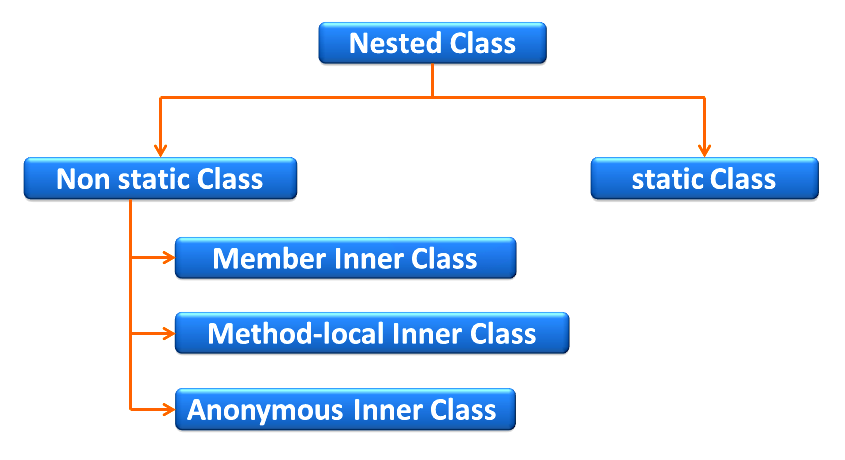

= Nested Classes

== Intro

=== Problem

[.step]
* Каждый раз, когда нам нужна новая функциональность, то создавать объект?
* Каждый раз, когда нам нужен контейнер для данных, то создавать объект?
* Каждый раз, когда нам нужно реализовать интерфейс, то нужно создавать класс?

=== Solution

[.step]
* *Nested Class*

== Nested Classes

=== Введение

[.step]
* Классы могут взаимодействовать друг с другом не только посредством наследования и использования ссылок, но и посредством организации логической структуры с определением одного класса в теле другого.
* В Java можно определить (вложить) один класс внутри определения другого класса, что позволяет группировать классы, логически связанные друг с другом, и динамично управлять доступом к ним.

=== Nested Classes

[.step]
* *Вложенным классом* называют *класс*, который является членом другого класса.
* Не статические *вложенные классы* называются *внутренними классами*.
* Экземпляр *внутреннего класса* находится внутри экземпляра *класса-оболочки*.
* Вложенный класс имеет полный доступ к полям и методам класса-оболочки, в том числе и объявленным как `private`.
* Согласно замыслу *Sun*, это не нарушает смысл `private`, потому что *вложенный класс* – это часть класса-оболочки, своего рода *внутренний тип*.

=== Nested Classes

[.fragment]

=== Nested Classes

[.step]
* Существует четыре базовых типа внутренних классов в Java:
[.step]
** *Static Nested classes* or *Member of outer class* (*статические вложенные классы*)
** *Nested Inner classes* (*вложенные внутренние классы*)
** *Method Local Inner classes* (*внутренние классы в локальном методе*)
** *Anonymous Inner classes* (*анонимные классы*)

== Static Nested classes

=== Static Nested classes

[.step]
* Чтобы работать со статическим классом, не надо создавать экземпляр класса-оболочки.
* Статический вложенный класс не имеет доступа к переменным класса-оболочки.
* Поведение статических вложенных классов очень похоже на поведение статических методов: чтобы работать со статическим классом, не надо создавать экземпляр класса-оболочки. Можно сразу создать экземпляр вложенного класса.

=== Static Nested classes

[.fragment]
[source,java]
----
class Math {
    public static class Factorial {
        private int result;
        private int key;

        public Factorial(int number, int x) {
            this.result = number;
            this.key = x;
        }

        public int getResult() {
            return result;
        }

        public int getKey() {
            return key;
        }
    }

    public static Factorial getFactorial(int x) {
        int result = 1;
        for (int i = 1; i <= x; i++) {
            result *= i;
        }
        return new Factorial(result, x);
    }
}
----

=== Static Nested classes

[.fragment]
[source,java]
----
public class Program {
    public static void main(String[] args) {
        Math.Factorial fact = Math.getFactorial(6);
        System.out.printf("Факториал числа %d равен %d \n",
                fact.getKey(), fact.getResult());
    }
}
----

== Nested Inner classes

=== Преимущества

[.step]
* Применение внутренних классов есть один из способов сокрытия кода, так как внутренний класс может быть абсолютно недоступен и не виден вне класса-владельца
* Одной из важнейших причин использования внутренних классов является возможность независимого наследования внутренними классами. Фактически при этом реализуется множественное наследование со своими преимуществами и проблемами

=== Внутренние классы

[.step]
* Слово `this` ссылается не только на экземпляр внутреннего класса, но и на экземпляр класса-оболочки
* Это означает, что экземпляр вложенного класса будет иметь полный доступ к переменным «своего» экземпляра класса-оболочки.

=== Nested Inner classes

[.fragment]
[source,java]
----
class Person {
    private String name;
    Account account;

    Person(String name, String password) {
        this.name = name;
        account = new Account(password);
    }

    public void displayPerson() {
        System.out.printf("Person \t Name: %s \t Password: %s \n",
                name, account.password);
    }

    public class Account {
        private String password;

        Account(String password) {
            this.password = password;
        }

        void displayAccount() {
            System.out.printf("Account Login: %s \t Password: %s \n",
                    Person.this.name, password);
        }
    }
}
----

=== Nested Inner classes

[.fragment]
[source,java]
----
public class Program {
    public static void main(String[] args) {
        Person tom = new Person("Tom", "qwerty");
        tom.displayPerson();
        tom.account.displayAccount();
    }
}
----

=== Пример

[.fragment]
[source,java]
----
public class Outer {
    private String myString = "outer";
    private String outerString = "outer field";

    void test() {
        System.out.println("Outer: " + myString);
        new Inner().testInner();
    }

    private void test2() {
        System.out.println("Outer: " + myString);
    }

    class Inner {
        private String myString = "inner";

        public void testInner() {
            System.out.println("Inner: " + myString);
            System.out.println("Inner: " + outerString);
            test2();
        }
    }
}
----

=== Пример

[.fragment]
[source,java]
----
Outer outer = new Outer();
outer.test()
----

[.fragment]
----
Outer: outer
Inner: inner
Inner: outer field
Outer: outer
----

=== Приоритет

[.step]
* В случае, если у внутреннего класса, суперкласса и класса-оболочки совпадает имя поля или метода, возможен конфликт приоритетов.
* При обращении извне к этому полю или методу надо каким-то образом выбрать один из совпавших.

=== Приоритет

[.step]
* По умолчанию приоритет будет следующим (по убыванию):
[.step]
** Внутренний класс
** Суперкласс
** Класс-оболочка

=== У внутреннего класса наивысший приоритет

[.fragment]
[source,java]
----
class SuperClass {
    String s = "super";
}
----

[.fragment]
[source,java]
----
public class ScopeConflict {
    String s = "outer";

    class Inner extends SuperClass {
        String s = "inner";
        void foo() {
            System.out.println(s);
        }
    }
}
----

=== У внутреннего класса наивысший приоритет

[.fragment]
[source,java]
----
ScopeConflict sc = new ScopeConflict();
ScopeConflict.Inner inner = sc.new Inner();
inner.foo();
----

[.fragment]
----
inner
----

=== Приоритет суперкласса средний

[.fragment]
[source,java]
----
class SuperClass {
    String s = "super";
}
----

[.fragment]
[source,java]
----
public class ScopeConflict {
    String s = "outer";

    class Inner extends SuperClass {
        // String s = "inner";

        void foo() {
            System.out.println(s);
        }
    }
}
----

=== Приоритет суперкласса средний

[.fragment]
[source,java]
----
ScopeConflict sc = new ScopeConflict();
ScopeConflict.Inner inner = sc.new Inner();
inner.foo();
----

[.fragment]
----
super
----

=== Класс-оболочка обладает наименьшим приоритетом

[.fragment]
[source,java]
----
class SuperClass {
    // String s = "super";
}
----

[.fragment]
[source,java]
----
public class ScopeConflict {
    String s = "outer";

    class Inner extends SuperClass {
        // String s = "inner";

        void foo() {
            System.out.println(s);
        }
    }
}
----

=== Класс-оболочка обладает наименьшим приоритетом

[.fragment]
[source,java]
----
ScopeConflict sc = new ScopeConflict();
ScopeConflict.Inner inner = sc.new Inner();
inner.foo();
----

[.fragment]
----
outer
----

=== Решение проблемы

[.fragment]
[source,java]
----
class SuperClass {
    String s = "super";
}
----

[.fragment]
[source,java]
----
public class ScopeConflict {
    String s = "outer";

    class Inner extends SuperClass {
        String s = "inner";

        void foo() {
            System.out.println(this.s);
            System.out.println(super.s);
            System.out.println(ScopeConflict.this.s);
        }
    }
}
----

[.fragment]
----
inner
super
outer
----

=== Внутренний класс может быть суперклассом

[.fragment]
[source,java]
----
public class Computer {
    int model;

    Computer(int i) {
        model = i;
    }

    public class HardDrive {
        int size;

        public HardDrive(int i) {
            size = i;
        }

        public HardDrive() {
            size = 40;
        }
    }
}
----

[.fragment]
[source,java]
----
class SCSI extends Computer.HardDrive {
    SCSI (Computer c) {
        c.super(80);
    }
}
----

=== Method Local Inner Classes

[.fragment]
[source,java]
----
class Person {
    private String name;

    Person(String name) {
        this.name = name;
    }

    public void setAccount(String password) {
        class Account {
            void display() {
                System.out.printf("Account Login: %s \t Password: %s \n",
                        name, password);
            }
        }
        Account account = new Account();
        account.display();
    }
}
----

=== Method Local Inner Classes

[.fragment]
[source,java]
----
public class Program {
    public static void main(String[] args) {
        Person tom = new Person("Tom");
        tom.setAccount("qwerty");
    }
}
----

=== Anonymous Inner classes

[.step]
* Для внутренних классов имена не всегда играют важной роли, поэтому от них можно избавиться.
* Классы без имени называются анонимными.
* Анонимные классы объявляются «на лету» в любом месте кода.

=== Anonymous Inner classes

[.fragment]
Extend a Class:

[.fragment]
[source,java]
----
new Book("Design Patterns") {
    @Override
    public String description() {
        return "Famous GoF book.";
    }
}
----

=== Anonymous Inner classes

[.fragment]
Implement an Interface:

[.fragment]
[source,java]
----
new Runnable() {
    @Override
    public void run() {
        // code
    }
}
----

=== Анонимные классы

[.step]
* Анонимные классы удобно создавать только, если класс очень маленький и содержит не более одного-двух методов.
* Анонимные классы с большим числом методов заметно ухудшают читабельность кода.
* Не стоит растягивать анонимный класс. Если он становится слишком большим – лучше дать ему имя.

=== Анонимные классы

[.step]
* Отличные кандидаты для использования анонимных классов:
[.step]
** обработчики нажатия кнопки
** реализация функциональных интерфейсов
** итератор для коллекции

== Вложенность и интерфейсы

=== Вложенность и интерфейсы

[.step]
* Аналогично вложенным классам, могут существовать вложенные интерфейсы. Они могут находиться внутри класса или внутри другого интерфейса, в зависимости от ситуации
* Также внутри интерфейса может находиться вложенный класс

=== Класс, вложенный в интерфейс

[.fragment]
[source,java]
----
public interface University {
    int NUMBER_FACULTY = 20;

    class LearningDepartment {// static по умолчанию
        public int idChief;

        public static void assignPlan(int idFaculty) {
            // реализация
        }
        public void acceptProgram() {
            // реализация
        }
    }
}
----

== Другое

=== Особенности компиляции

[.step]
* При компиляции проекта названия файлов `.class` для внутренних классов будут иметь вид `OuterClass$InnerClass.class`
* Для анонимных классов файлы `.class` будут называться `OuterClass$n.class`, где `n` – натуральное число.

=== Стоит ли их использовать?

[.step]
* Да, но нужно правильно их использовать.
* Так же следует хорошо понимать механизмы их работы.
