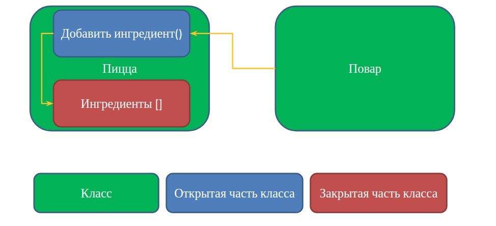
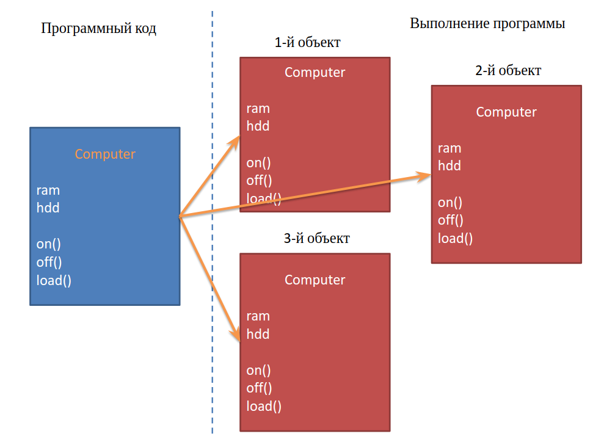
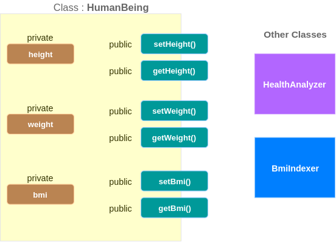
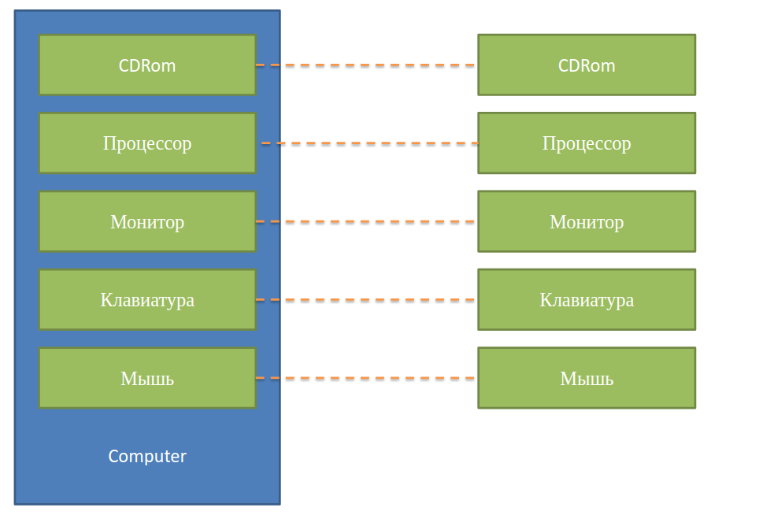

= OOP. Classes and Objects

== Intro

=== Problem

=== Структурное программирование

[.fragment]
Принцип: код воздействует на данные

[.fragment]
image::../../assets/img/java/core/oop/classes-and-objects/structured-programming.svg[Structured Programming]

=== Solution

=== Объектно-ориентированное программирование

[.fragment]
Принцип: данные управляют доступом к коду

[.fragment]

== Classes and objects

=== OOP concepts

[.step]
* *ООП* — это парадигма программирования, в которой главные понятия *объекты* и *классы*.
* *ООП* возникло в результате развития идей процедурного программирования, где *данные* и *функции* (*методы*) их обработки формально не связаны.

=== Classes and objects

[.step]
* *Класс* (*Class*)- это _шаблон_ для создания *объектов*
* *Объект* (*Object*) - это _экземпляр_ *класса*
* _Функция_, созданная внутри класса, называется *метод* (*method*)
* _Переменная_, созданная внутри класса, называется *поле* (*field*)

=== Class definition: syntax

[.fragment]
*Класс* определяет _структуру_ и _поведение_ *объектов*

[.fragment]
[source,java]
----
class Person {
    // class content
}
----

=== Objects

[.step]
* *Объект* – любой предмет, четко структурированный и имеющий смысл в контексте решаемой предметной области.
* Все *объекты* имеют одинаковые *наборы полей* данных (*атрибуты объекта*), но с независимыми значениями этих данных для каждого объекта.
* Значения *полей* данных объекта задают его *состояние*.
* *Методы*  объекта задают его *поведение*.

=== Objects

[.step]
* Объекты безымянны, и доступ к ним осуществляется только через *ссылочные переменные*.

[.fragment]
[source,java]
User tom = new User();

=== Понятие данных

[.fragment]
Данные – члены класса, которые называются *полями* или *переменными класса*, объявляются в классе следующим образом:

[.fragment]
[source,java]
модификатор тип имя;

[.fragment]
[source,java]
public int age;

=== Модификаторы

[.step]
* Модификаторы доступа:
[.step]
** `public`
** `private`
** `protected`
* Специализированные модификаторы:
[.step]
** `final`
** `static`
** `synchronized`
** `native`

=== Метод

[.step]
* *Метод* – это обособленный блок кода.

[.fragment]
[source,java]
----
cпецификатор возвращаемый-тип идентификатор-метода(параметры) {
    тело-метода
}
----

[.fragment]
[source,java]
----
public class Human {
    private double temperature; // поле класса

    public boolean isIll() { // метод
        return temperature > 37.0 || temperature < 36.2;
    }
}
----

=== Области видимости переменных

[.step]
* *Область видимости* — часть текста программы, на протяжении которого к объекту можно обращаться по его имени.
* В языках программирования выделяют:
[.step]
** *глобальную* области видимости, если объявление происходит вне любой функции или блока кода и доступно в любой точке программы.
** *локальную* области видимости, если оно объявлено в теле функции или в пространстве имен. *Область видимости*: от объявления и до окончания блока кода.

=== Области видимости переменных

[.step]
* Основные *области видимости* в Java:
[.step]
** класс (глобальная)
** метод (локальная)
** блоки кода (локальная)

=== Class definition: example

[.fragment]
[source,java]
----
class Person {
    String name;
    int age;

    void displayInfo() {
        System.out.printf("Name: %s \tAge: %d\n", name, age);
    }
}
----

[.fragment]
[source,java]
----
class Program {
    public static void main(String[] args) {
        Person tom;
    }
}
----

== Constructor

=== Constructor (Конструктор)

[.step]
* *Конструктор* и *метод* внешне похожи.
* *Конструктор* имеет имя как у *класса*.
* В *конструкторе* не должно быть лишней логики.
* У конструкторов нет типа возвращаемого результата.
* Если *конструктор* не указан – компилятор создаст *конструктор по умолчанию*.
* Если создали свой *конструктор* – *конструктор по умолчанию* не создаётся.

=== Default Constructor: example

[.fragment]
[source,java]
----
class Person {
    String name;
    int age;

    void displayInfo() {
        System.out.printf("Name: %s \tAge: %d\n", name, age);
    }
}
----

=== Default Constructor: example

[.fragment]
[source,java]
----
public class Program {
    public static void main(String[] args) {
        Person tom = new Person();
        tom.displayInfo();
        tom.name = "Tom";
        tom.age = 34;
        tom.displayInfo();
    }
}
----

=== Constructors: example

[.fragment]
[source,java]
----
class Person {
    String name;
    int age;

    Person() {
        name = "Undefined";
        age = 18;
    }

    Person(String n) {
        name = n;
        age = 18;
    }

    Person(String n, int a) {
        name = n;
        age = a;
    }

    void displayInfo() {
        System.out.printf("Name: %s \tAge: %d\n", name, age);
    }
}
----

=== Constructors: example

[.fragment]
[source,java]
----
public class Program {
    public static void main(String[] args) {
        Person bob = new Person();
        bob.displayInfo();
        Person tom = new Person("Tom");
        tom.displayInfo();
        Person sam = new Person("Sam", 25);
        sam.displayInfo();
    }
}
----

== Keyword `this`

=== Keyword `this`: example

[.fragment]
[source,java]
----
class Person {
    String name;
    int age;

    Person() {
        this("Undefined", 18);
    }

    Person(String name) {
        this(name, 18);
    }

    Person(String name, int age) {
        this.name = name;
        this.age = age;
    }

    void displayInfo() {
        System.out.printf("Name: %s \tAge: %d\n", name, age);
    }
}
----

=== Keyword `this`: example

[.fragment]
[source,java]
----
public class Program {
    public static void main(String[] args) {
        Person undef = new Person();
        undef.displayInfo();
        Person tom = new Person("Tom");
        tom.displayInfo();
        Person sam = new Person("Sam", 25);
        sam.displayInfo();
    }
}
----

==  Initialization Block (блок инициализации)

===  Initialization Block

[.step]
* При описании класса могут быть использованы *блоки инициализации*.
* *Блоком инициализации* называется код, заключенный в фигурные скобки и не принадлежащий ни одному методу текущего класса.

[.fragment]
[source,java]
{ /* код */ }

===  Initialization Block

[.step]
* *Блоки инициализации* чаще всего используются в качестве инициализаторов полей, но могут содержать вызовы методов как текущего класса, так и не принадлежащих ему.
* При создании объекта класса *блоки инициализации* вызываются последовательно, в порядке размещения, вместе с инициализацией полей как простая последовательность операторов, и только после выполнения последнего *блока инициализации* будет вызван *конструктор* класса.

===  Initialization Block

[.step]
* Операции с полями класса внутри *блока инициализации* до явного объявления этого поля возможны только при использовании ссылки `this`, представляющую собой ссылку на текущий объект.
* *Блок инициализации* может быть объявлен со спецификатором `static`. В этом случае он вызывается только один раз в жизненном цикле приложения при создании объекта или при обращении к статическому методу (полю) данного класса.

=== Example

[.fragment]
[source,java]
----
class Person {
    String name;
    int age;

    {
        this.name = "Undefined";
        this.age = 18;
    }

    Person() {
    }

    Person(String name) {
        this.name = name;
    }

    Person(String name, int age) {
        this.name = name;
        this.age = age;
    }

    void displayInfo() {
        System.out.printf("Name: %s \tAge: %d\n", name, age);
    }
}
----

=== Example

[.fragment]
[source,java]
----
public class Program {
    public static void main(String[] args) {
        Person undef = new Person();
        undef.displayInfo();
        Person tom = new Person("Tom");
        tom.displayInfo();
    }
}
----

=== How does it work?

[.fragment]
[source,java]
----
public class Init {
    {
        System.out.println("initializer (1), id=" + this.id);
    }

    private int id = 42;

    public Init(int d) {
        id = d;
        System.out.println("constructor, id=" + id);
    }

    {
        System.out.println("initializer (2), id=" + this.id);
    }

    static {
        System.out.println("static initializer");
    }

    public int getId() {
        return id;
    }

    {
        id = 10;
        System.out.println("initializer (3), id=" + id);
    }
}
----

=== How does it work?

[.fragment]
[source,java]
----
public class Example1 {
    public static void main(String[] args) {
        Init obj = new Init(7);
        System.out.println("value for id=" + obj.getId());
    }
}
----

[.fragment]
----
static initializer
initializer (1), id=0
initializer (2), id=42
initializer (3), id=10
constructor, id=7
value for id=7
----

== Objects as parameters of methods

=== Objects as parameters of methods: example

[.fragment]
[source,java]
----
class Person {
    private String name;

    Person(String name) {
        this.name = name;
    }

    public void setName(String name) {
        this.name = name;
    }

    public String getName() {
        return this.name;
    }
}
----

=== Objects as parameters of methods: example

[.fragment]
[source,java]
----
public class Program {
    public static void main(String[] args) {
        Person kate = new Person("Kate");
        System.out.println(kate.getName());
        changeName(kate);
        System.out.println(kate.getName());
    }

    static void changeName(Person p) {
        p.setName("Alice");
    }
}
----

=== Objects as parameters of methods: example 2

[.fragment]
[source,java]
----
class Person {
    private String name;

    Person(String name) {
        this.name = name;
    }

    public void setName(String name) {
        this.name = name;
    }

    public String getName() {
        return this.name;
    }
}
----

=== Objects as parameters of methods: example 2

[.fragment]
[source,java]
----
public class Program {
    public static void main(String[] args) {
        Person kate = new Person("Kate");
        System.out.println(kate.getName());
        changePerson(kate);
        System.out.println(kate.getName());
    }

    static void changePerson(Person p) {
        p = new Person("Alice");
        p.setName("Ann");
    }

    static void changeName(Person p) {
        p.setName("Alice");
    }
}
----

== Packages

=== Packages

[.step]
* Для логического группирования множеств классов в связанные группы в Java применяется понятие *пакета* (*package*).
* *Пакеты* обеспечивают:
[.step]
** независимые пространства имён (*namespaces*)
** ограничение доступа к классам

[.step]
* *Пакеты* — это фактически обычная директория.

=== Package definition: syntax

[.fragment]
[source,java]
----
package your.package.which.can.has.any.name;
----

=== Package definition: example

[.fragment]
[source,java]
----
package com.rakovets;

class Person {
    String name;
    int age;

    Person(String name, int age) {
        this.name = name;
        this.age = age;
    }

    void displayInfo() {
        System.out.printf("Name: %s \t Age: %d \n", name, age);
    }
}
----

=== Package definition: example

[.fragment]
[source,java]
----
package com.rakovets;

public class Program {
    public static void main(String[] args) {
        Person kate = new Person("Kate", 32);
        kate.displayInfo();
    }
}
----

=== Packages and Terminal: example

[.fragment]
[source,shell script]
----
cd D:\home\rakovets\dev
javac com\rakovets\Program.java
java com.rakovets.Program
----

=== `import` Packages and Classes: example

[.fragment]
[source,java]
----
package com.rakovets;

import java.util.Scanner;
import java.util.*;

public class Program {
    public static void main(String[] args) {
        Scanner in = new Scanner(System.in);
    }
}
----

=== `import` Packages and Classes: example

[.fragment]
[source,java]
----
java.util.Date utilDate = new java.util.Date();
java.sql.Date sqlDate = new java.sql.Date();
----

== Access modifiers (Модификаторы доступа)

=== Access modifiers

[.step]
* `public` - доступно из любого места, но чаще всего для внешнего интерфейса.
* `protected` - внутри пакета и в дочерних классах.
* _friendly_/_default_/_package_ - доступно внутри пакета.
* `private` - доступно только внутри класса – для скрытия реализации (инкапсуляции).

=== Access modifiers

[.fragment]
[options="header",cols="3,1,1,1,1"]
|===
||`private`|_friendly_|`protected`|`public`
|same class|+|+|+|+
|same package subclass|-|+|+|+
|same package non-subclass|-|+|+|+
|different package subclass|-|-|+|+
|different package non-subclass|-|-|-|+
|===

=== Access modifiers

[.fragment]
[source,java]
----
class Person {
    String name;
    int age;

    public Person(String name, int age) {
        this.name = name;
        this.age = age;
    }
}
----

[.fragment]
Bad practice.

=== Access modifiers

[.fragment]
[source,java]
----
public class Program {
    public static void main(String[] args) {
        Person kate = new Person("Kate", 30);
        System.out.println(kate.age);
        kate.age = 33;
        System.out.println(kate.age);
    }
}
----

[.fragment]
Bad practice.

=== Access modifiers

[.fragment]
Good practice.

[.fragment]
[source,java]
----
public class Person {
    private String name;
    private int age;

    public Person(String name, int age) {
        this.name = name;
        this.age = age;
    }

    public String getName() {
        return this.name;
    }

    public void setName(String name) {
        this.name = name;
    }

    public int getAge() {
        return this.age;
    }

    public void setAge(int age) {
        this.age = age;
    }
}
----

=== Access modifiers

[.fragment]
Good practice.

[.fragment]
[source,java]
----
public class Program {
    public static void main(String[] args) {
        Person kate = new Person("Kate", 30);
        System.out.println(kate.getAge());
        kate.setAge(33);
        System.out.println(kate.getAge());
    }
}
----

== Modifiers (Модификаторы)

=== Modifiers `final`

[.fragment]
Модификатор `final` (_неизменяемый_) может применяться к классам, методам и переменным.

[.fragment]
[source,java]
final double PI = 3.14; // константы

[.fragment]
[source,java]
final void run() {} // запрещено переопределение метода

[.fragment]
[source,java]
final class Example {} // запрещено наследование

=== Modifiers `native`

[.step]
* Приложение на языке Java может вызывать методы, написанные на языке С++. Такие методы объявляются с ключевым словом `native`, которое сообщает компилятору, что метод реализован в другом месте.

[.fragment]
[source,java]
public native int loadCripto(int num);

[.step]
* Методы, помеченные `native`, можно переопределять обычными методами в подклассах.

=== Modifiers `synchronized`

[.step]
* При использовании нескольких потоков управления в одном приложении необходимо синхронизировать методы, обращающиеся к общим данным.
* Когда интерпретатор обнаруживает `synchronized`, он включает код, блокирующий доступ к данным при запуске потока и снимающий блок при его завершении.

=== Modifiers `static`

=== Ключевое слово `static`

[.step]
* Модификатор `static` (единственный) применяется к методам, переменным и логическим блокам.
* Поля данных, объявленные в классе как `static`, являются общими для всех объектов класса и называются *переменными класса*.
* Для работы со статическими атрибутами используются статические методы, объявленные со спецификатором `static` являются *методами класса*.
* Не привязаны ни к какому объекту.

=== Ключевое слово `static`

[.step]
* Не содержат указателя `this` на конкретный объект, вызвавший метод.
* Реализует парадигму «раннего связывания», жестко определяющую версию метода на этапе компиляции.
* Статические поля и методы не могут обращаться к нестатическим полям и методам напрямую по причине недоступности указателя this.
* Для обращения к статическим полям и методам достаточно имени класса, в котором они определены.

=== non `static`

[.fragment]

=== `static`

[.fragment]
image::../../assets/img/java/core/oop/classes-and-objects/static-members.png[Static members]

=== Example

[.fragment]
[source,java]
----
public static void main(String[] args) {
    // statements
}
----

=== `static` fields: example

[.fragment]
[source,java]
----
class Person {
    private int id;
    static int counter = 1;

    Person() {
        id = counter++;
    }

    public void displayId() {
        System.out.printf("Id: %d \n", id);
    }
}
----

=== `static` fields: example

[.fragment]
[source,java]
----
public class Program {
    public static void main(String[] args) {
        Person tom = new Person();
        Person bob = new Person();
        tom.displayId();
        bob.displayId();
        System.out.println(Person.counter);
        Person.counter = 8;
        Person sam = new Person();
        sam.displayId();
    }
}
----

=== `static` constants: example

[.fragment]
[source,java]
----
public class Program {
    public static void main(String[] args) {
        double radius = 60;
        System.out.printf("Radisu: %f \n", radius);
        System.out.printf("Area: %f \n", Math.PI * radius);
    }
}

public class Math {
    public static final double PI = 3.14;
}
----

=== `static` methods: example

[.fragment]
[source,java]
----
public class Operation {
    static int sum(int x, int y) {
        return x + y;
    }

    static int subtract(int x, int y) {
        return x - y;
    }

    static int multiply(int x, int y) {
        return x * y;
    }
}
----

=== `static` methods: example

[.fragment]
[source,java]
----
public class Program {
    public static void main(String[] args) {
        System.out.println(Operation.sum(45, 23));
        System.out.println(Operation.subtract(45, 23));
        System.out.println(Operation.multiply(4, 23));
    }
}
----

=== `static` initializers: example

[.fragment]
[source,java]
----
class Person {
    private int id;
    static int counter;

    static {
        counter = 105;
        System.out.println("Static initializer");
    }

    Person() {
        id = counter++;
        System.out.println("Constructor");
    }

    public void displayId() {
        System.out.printf("Id: %d \n", id);
    }
}
----

=== `static` initializers: example

[.fragment]
[source,java]
----
public class Program {
    public static void main(String[] args) {
        Person tom = new Person();
        Person bob = new Person();
        tom.displayId();
        bob.displayId();
    }
}
----

=== Static `import`: example

[.fragment]
[source,java]
----
package study;

import static java.lang.System.*;
import static java.lang.Math.*;

public class Program {
    public static void main(String[] args) {
        double result = sqrt(20);
        out.println(result);
    }
}
----

== Interface

=== Interface (Интерфейс)

[.fragment]
Открытая часть класса, с помощью которой другие классы могут с ним взаимодействовать

[.fragment]
image::../../assets/img/java/core/oop/classes-and-objects/interface.png[Interface]

=== Interface

[.fragment]

== Composition

=== Composition (Композиция)

[.fragment]
image::../../assets/img/java/core/oop/classes-and-objects/non-composition.png[Non Composition]

=== Composition

[.fragment]

== Total

=== Нужно ли всегда создавать объекты?

[.step]
* Даже если программа простейшая – всегда нужно создавать объекты и писать код в стиле ООП
* Это должно быть привычкой
* В программе не должно быть лишних объектов
* Никогда не давайте объекту чужие понятия и действия
