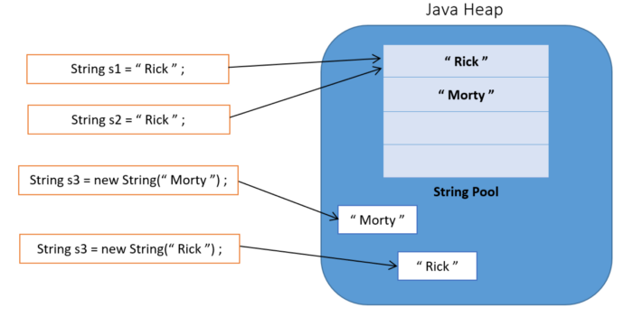

= String

== Intro

=== Problem

[.step]
* Большая часть информации, которая используется в программном обеспечении является текстовой.
* Как работать с текстом в Java?

=== Solution

[.step]
* Use class `String`

== Class `String`

=== Class `String`

[.step]
* `String` из пакета `java.lang`
* `String` *immutable* (*неизменяемый*)
* *immutable* значит, что после его создания он (и его содержимое) не может изменяться.

[.fragment]
[source,java]
----
String str = "Hello Java!";
----

=== How create `String` objects?

[.fragment]
[source,java]
----
String str1 = "Java";
String str2 = new String();
String str3 = new String("JVM");
String str4 = new String(new char[] {'h', 'e', 'l', 'l', 'o'});
String str5 = new String(
        new char[] {'w', 'e', 'l', 'c', 'o', 'm', 'e'}, 3, 4);

System.out.println(str1); // 'Java'
System.out.println(str2); // ''
System.out.println(str3); // 'JVM'
System.out.println(str4); // 'hello'
System.out.println(str5); // 'come'
----

=== Operator `+` for strings

[.fragment]
Для _объектов_ и _литералов_ типа `String` определена одна операция `+` (*конкатенация*), которая объединяет
 две строки.

[.fragment]
[source,java]
----
String str1 = "Java";
String str2 = "Hello";
String str3 = str1 + " " + str2;

System.out.println(str3);
----

[.fragment]
----
Hello Java
----

== `String`: main methods

=== `length(): int`

[.fragment]
[source,java]
----
String str1 = "Java";
System.out.println(str1.length());
----

[.fragment]
----
4
----

=== `toCharArray(): char[]`

[.fragment]
[source,java]
----
String str1 = new String(new char[] {'h', 'e', 'l', 'l', 'o'});
char[] helloArray = str1.toCharArray();
----

=== Как проверить что строка пуста?

[.fragment]
[source,java]
----
String s = null; // строка не указывает на объект
if (s.length() == 0) {
    System.out.println("String is empty");
}
----

[.fragment]
[source,java]
----
String s = null; // строка не указывает на объект
if (s.length() == 0) { // null.length() - `NullPointerException`
    System.out.println("String is empty");
}
----

=== `isEmpty(): boolean`

[.fragment]
[source,java]
----
public boolean isEmpty() {
    return value.length == 0;
}
----

[.fragment]
[source,java]
----
String s = null; // строка не указывает на объект
if (s.isEmpty()) { // null.length() - `NullPointerException`
    System.out.println("String is empty");
}
----

=== Как же этого избежать?

[.fragment]
[source,java]
----
String s = null; // строка не указывает на объект
if (s != null && s.isEmpty()) {
    System.out.println("String is empty or null");
}
----

[.fragment]
----
String is empty or null
----

=== `concat(String): String`

[.fragment]
[source,java]
----
String str1 = "Java";
String str2 = "Hello";
str2 = str2.concat(str1);
----

[.fragment]
----
HelloJava
----

=== `join(CharSequence, CharSequence...): String`

[.fragment]
[source,java]
----
String str1 = "Java";
String str2 = "Hello";
String str3 = String.join(" ", str2, str1);
----

[.fragment]
----
Hello Java
----

=== `charAt(int): char`

[.fragment]
[source,java]
----
String str = "Java";
char c = str.charAt(2);

System.out.println(c);
----

[.fragment]
----
v
----

=== `getChars(int, int, char[], int): void`

[.fragment]
[source,java]
----
String str = "Hello world!";
int srcBegin = 6;
int srcEnd = 11;
char[] dst = new char[end - start];
int dstBegin = 0;
str.getChars(srcBegin, srcEnd, dst, dstBegin);

System.out.println(dst);
----

[.fragment]
----
world
----

=== `equals(Object): boolean`

[.fragment]
[source,java]
----
String str1 = "Hello";
String str2 = "hello";

System.out.println(str1.equals(str2));
----

[.fragment]
----
false
----

=== `equalsIgnoreCase(Object): boolean`

[.fragment]
[source,java]
----
String str1 = "Hello";
String str2 = "hello";

System.out.println(str1.equalsIgnoreCase(str2));
----

[.fragment]
----
true
----

=== `regionMatches(int, String, int, int): boolean`

[.fragment]
[source,java]
----
regionMatches(int toffset, String other, int oofset, int len): boolean
regionMatches(boolean ignoreCase, int toffset, String other, int oofset, int): boolean
----

=== `regionMatches(int, String, int, int): boolean`

[.fragment]
[source,java]
----
String str1 = "Hello world";
String str2 = "I work";
boolean result = str1.regionMatches(6, str2, 2, 3);

System.out.println(result);
----

[.fragment]
----
true
----

=== `compareTo(String): int` и `compareToIgnoreCase(String): int`

[.fragment]
[source,java]
----
String str1 = "hello";
String str2 = "world";
String str3 = "hell";

System.out.println(str1.compareTo(str2));
System.out.println(str1.compareTo(str3));
----

[.fragment]
----
1 // str1 больше чем str3 по количеству символов
-15 // str1 меньше чем strt2 так находится на 15 символов ближе к началу отсчета
----

=== `indexOf(String): int` и `lastIndexOf(String): int`

[.fragment]
[source,java]
----
String str = "Hello world";
int index1 = str.indexOf('l');
int index2 = str.indexOf("wo");
int index3 = str.lastIndexOf('l');
----

[.fragment]
----
2
6
9
----

=== `startsWith(String): boolean` и `endsWith(String): boolean`

[.fragment]
[source,java]
----
String str = "myfile.exe";
boolean start = str.startsWith("my");
boolean end = str.endsWith("exe");
----

[.fragment]
----
true
true
----

=== `replace(CharSequence, CharSequence)`

[.fragment]
[source,java]
----
String str = "Hello world";
String replStr1 = str.replace('l', 'd');
String replStr2 = str.replace("Hello", "Bye");
----

[.fragment]
----
Heddo wordd
Bye world
----

=== `trim(): String`

[.fragment]
[source,java]
----
String str = "  hello world  ";
str = str.trim();
----

[.fragment]
----
hello world
----

=== `substring(int): String` and `substring(int, int): String`

[.fragment]
[source,java]
----
String str = "Hello world";
String substr1 = str.substring(6);
String substr2 = str.substring(3,5);
----

[.fragment]
----
world
lo
----

=== `toLowerCase(): String` и `toUpperCase(): String`

[.fragment]
[source,java]
----
String str = "Hello World";
System.out.println(str.toLowerCase());
System.out.println(str.toUpperCase());
----

[.fragment]
----
hello world
HELLO WORLD
----

=== `split(String): String[]` and `split(String, int): String[]`

[.fragment]
[source,java]
----
String text = "FIFA will never regret it";
String[] words = text.split(" ");
for (String word : words) {
    System.out.println(word);
}
----

[.fragment]
----
FIFA
will
never
regret
it
----

== String Pool

=== String Pool

[.fragment]
*String Pool* (*Пул строк*) — это набор строк, который хранится в *Heap*.

[.fragment]

=== String Pool

[.step]
* *ЕСЛИ* `String` создается через оператор `new`, *ТО* она не помещается в *String Pool*.
* *ЕСЛИ* ее необходимо поместить в *String Pool*, *ТО* используется метод `intern()`.

=== String Poll

[.fragment]
[source,java]
----
String s1 = "Rick";
// s1 in String Pool
String s2 = "Rick";
// s2 in String Pool: s2 equals s1
String s3 = new String("Rick");
// s3 in Heap: s3 NOT equals s1, s2
String s4 = new String("Rick");
// s4 in Heap: s4 NOT equals s1, s2, s3
String s5 = s4.intern();
// ss5move to Strint Poll: s5 equals s1, s2
----

== `StringBuffer` и `StringBuilder`

=== Immutable `String`

[.step]
* Класс `String` *immutable* (не изменяемый).
* Еще раз: он *immutable*
* Он реально *immutable*!

[.fragment]
[source,java]
----
String str = "Hello";
str += " Java";
----

[.fragment]
Код приведенный выше, приводит к тому, что создается новый объект, и содержимое обеих исходных строк в него копируется.

=== `StringBuffer` и `StringBuilder`

[.step]
* Если класс `String` *immutable*, то что делать когда нужно часто изменять строку?
* Каждый раз при изменении строки, создается новая и под нее выделяется память.
* Эту проблему решают объекты типа: `StringBuilder` и `StringBuffer`
* Оба класса позволяют менять содержимое находящихся в них строк.
* При этом они не потребляют лишнюю память.

[.fragment]
[source,java]
----
String str = "Hello";
StringBuilder strBuilder = new StringBuilder(str);
strBuilder.append(" Java");
----

=== `StringBuffer` и `StringBuilder`

[.step]
* Класс `StringBuilder` - _NOT thread safe_ (потоко-НЕбезопасный), но быстрый
* Класс `StringBuffer` - _thread safe_ (потоко-безопасный), но медленный

=== `StringBuffer` constructors

[.step]
* `StringBuffer()`
* `StringBuffer(int capacity)`
* `StringBuffer(String str)`
* `StringBuffer(CharSequence chars)`

=== `StringBuilder` constructors

[.step]
* `StringBuilder()`
* `StringBuilder(int capacity)`
* `StringBuilder(String str)`
* `StringBuilder(CharSequence chars)`

=== `StringBuffer` и `StringBuilder`

[.fragment]
[source,java]
----
String str = "Java";
StringBuffer strBuffer = new StringBuffer(str);
System.out.println("Емкость: " + strBuffer.capacity()); // 20
strBuffer.ensureCapacity(32);
System.out.println("Емкость: " + strBuffer.capacity()); // 42
System.out.println("Длина: " + strBuffer.length()); // 4
----

=== `charAt(int): char` и `setCharAt(int, char): void`

[.fragment]
[source,java]
----
StringBuffer strBuffer = new StringBuffer("Java");
char c = strBuffer.charAt(0);
System.out.println(c);
----

[.fragment]
----
J
----

[.fragment]
[source,java]
----
strBuffer.setCharAt(0, 'c');
System.out.println(strBuffer.toString());
----

[.fragment]
----
cava
----

=== `getChars(int, int, char[], int): void`

[.fragment]
[source,java]
----
StringBuffer strBuffer = new StringBuffer("world");
int startIndex = 1;
int endIndex = 4;
char[] buffer = new char[endIndex - startIndex];
strBuffer.getChars(startIndex, endIndex, buffer, 0);
System.out.println(buffer);
----

[.fragment]
----
orl
----

=== `append(*): StringBuffer`

[.fragment]
[source,java]
----
StringBuffer strBuffer = new StringBuffer("hello");
strBuffer.append(" world");
System.out.println(strBuffer.toString());
----

[.fragment]
----
hello world
----

=== `insert(int, *): StringBuffer`

[.fragment]
[source,java]
----
StringBuffer strBuffer = new StringBuffer("word");

strBuffer.insert(3, 'l');
System.out.println(strBuffer.toString());

strBuffer.insert(0, "s");
System.out.println(strBuffer.toString());
----

[.fragment]
----
world
sworld
----

=== `delete(int, int): StringBuffer` и `deleteCharAt(int): StringBuffer`

[.fragment]
[source,java]
----
StringBuffer strBuffer = new StringBuffer("assembler");
strBuffer.delete(0, 2);
System.out.println(strBuffer.toString());

strBuffer.deleteCharAt(6);
System.out.println(strBuffer.toString());
----

[.fragment]
----
sembler
semble
----

=== `substring(int): String` и `substring(int, int): String`

[.fragment]
[source,java]
----
StringBuffer strBuffer = new StringBuffer("hello java!");
String str1 = strBuffer.substring(6); // обрезка строки с 6 символа до конца
System.out.println(str1);

String str2 = strBuffer.substring(3, 9); // обрезка строки с 3 по 9 символ
System.out.println(str2);
----

[.fragment]
----
java!
lo jav
----

=== `setLength(int): void`

[.fragment]
[source,java]
----
StringBuffer strBuffer = new StringBuffer("hello");
strBuffer.setLength(10);
System.out.println(strBuffer.toString() + "'");

strBuffer.setLength(4);
System.out.println(strBuffer.toString());
----

[.fragment]
----
hello     '
hell
----
=== `replace(int, int, String): StringBuffer`

[.fragment]
[source,java]
----
StringBuffer strBuffer = new StringBuffer("hello world!");
strBuffer.replace(6, 11, "java");
System.out.println(strBuffer.toString());
----

[.fragment]
----
hello java!
----

=== `reverse(): StringBuffer`

[.fragment]
[source,java]
----
StringBuffer strBuffer = new StringBuffer("assembler");
strBuffer.reverse();
System.out.println(strBuffer.toString());
----

[.fragment]
----
relbmessa
----
